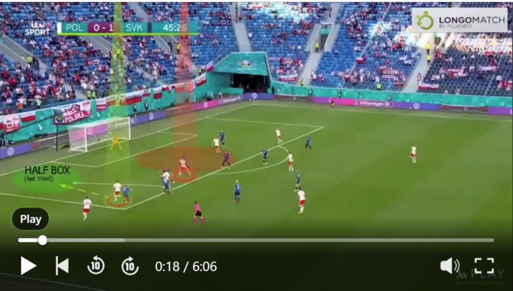

# Utilizing Voronoi Tessellations Animations as a Proxy for Pitch Control in Football

This repository provides an example of creating a Voronoi tessellation animation and demonstrates how this type of animation can be used as a proxy for pitch control in football. The example can be found in the VoronoiAnimationSlovakiaPoland.ipynb file. The data used for this example is from a goal that Poland scored against Slovakia during the UEFA Euro 2020. The positional data was manually extracted from images using the [getPositionalData tool](https://github.com/mumoyarce96/getPositionalData)

