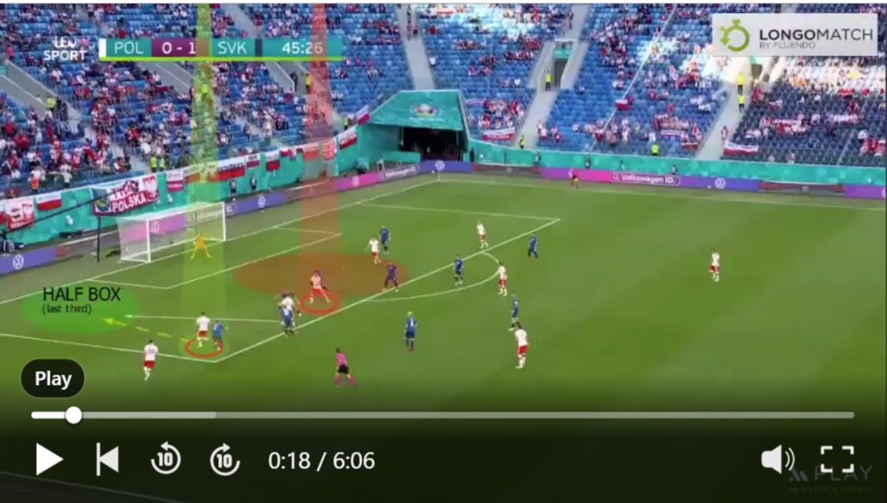
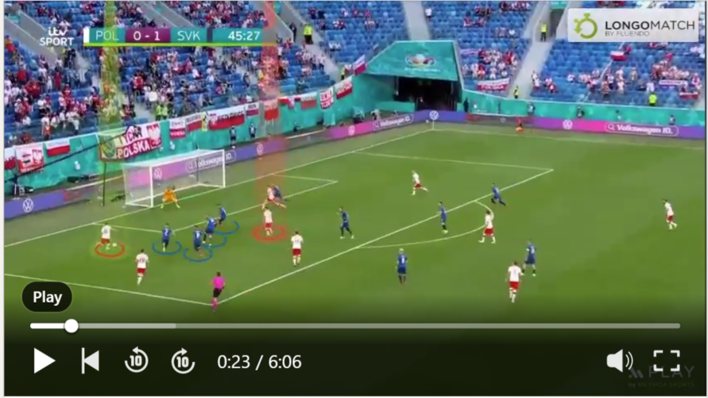
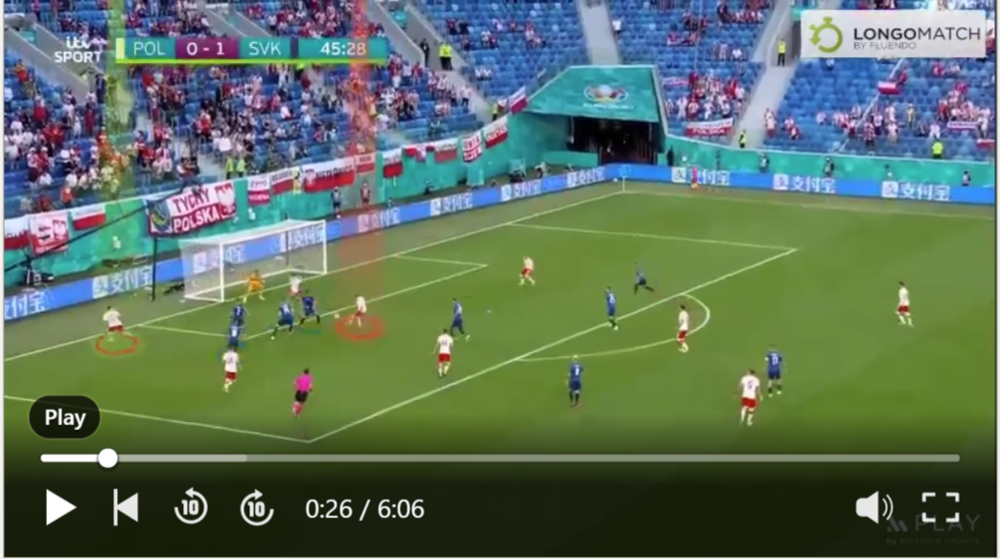

# Utilizing Voronoi Tessellations Animations as a Proxy for Pitch Control in Football

This repository provides an example of creating a Voronoi tessellation animation and demonstrates how this type of animation can be used as a proxy for pitch control in football. The example can be found in the _VoronoiAnimationSlovakiaPoland.ipynb_ file. The data used for this example is from a goal that Poland scored against Slovakia during the UEFA Euro 2020. The positional data was manually extracted from the following images using the [getPositionalData tool](https://github.com/mumoyarce96/getPositionalData)

In order to generate a more fluid animation that accurately depicts the trajectories of the players and the ball, interpolation is necessary to add additional data points between the ones obtained from the limited number of images. The code for the interpolation function can be found in the interpolation.py file. This function is designed to fill in the gaps between the available data points and provide a smoother animation. By utilizing this interpolation technique, the resulting animation will offer a more seamless visualization of player and ball movements.
